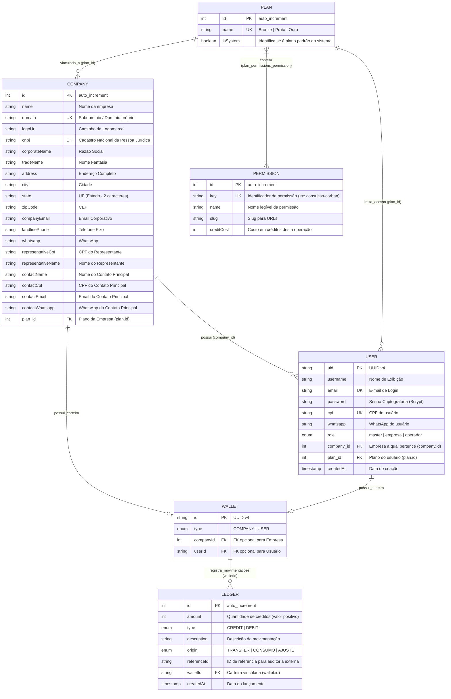

# 🗄️ Documentação do Banco de Dados — Veridata SaaS

Este diretório contém a modelagem física do banco de dados relacional **MySQL** (base de dados `saas`), que é sincronizada automaticamente pelo TypeORM com base nas entidades do NestJS.

---

## 🗺️ Diagrama de Entidade-Relacionamento (DER)

Abaixo está a representação visual de como as tabelas se relacionam no sistema:

---

## 📋 Tabelas e Colunas em Detalhes

### 1. Tabela `company`
Armazena os dados das empresas cadastradas no ecossistema SaaS (Tenants).

| Coluna | Tipo | Nulo | Chave | Padrão | Descrição |
| :--- | :--- | :---: | :---: | :---: | :--- |
| `id` | `int` | Não | PK | *Auto-increment* | Identificador único da empresa |
| `name` | `varchar(255)` | Não | - | - | Nome fantasia de exibição |
| `domain` | `varchar(255)` | Não | Unique | - | Domínio próprio ou subdomínio white-label |
| `logoUrl` | `varchar(255)` | Sim | - | `NULL` | Caminho da imagem da logo da empresa |
| `cnpj` | `varchar(255)` | Sim | Unique | `NULL` | CNPJ da empresa |
| `corporateName` | `varchar(255)` | Sim | - | `NULL` | Razão Social |
| `tradeName` | `varchar(255)` | Sim | - | `NULL` | Nome Fantasia (Receita) |
| `address` | `varchar(255)` | Sim | - | `NULL` | Logradouro, número e complemento |
| `city` | `varchar(255)` | Sim | - | `NULL` | Município |
| `state` | `varchar(2)` | Sim | - | `NULL` | UF do estado (ex: `SP`, `MG`) |
| `zipCode` | `varchar(255)` | Sim | - | `NULL` | CEP de localização |
| `companyEmail` | `varchar(255)` | Sim | - | `NULL` | E-mail corporativo institucional |
| `landlinePhone` | `varchar(255)` | Sim | - | `NULL` | Telefone comercial fixo |
| `whatsapp` | `varchar(255)` | Sim | - | `NULL` | WhatsApp comercial da empresa |
| `representativeCpf` | `varchar(255)` | Sim | - | `NULL` | CPF do representante legal |
| `representativeName` | `varchar(255)` | Sim | - | `NULL` | Nome do representante legal |
| `contactName` | `varchar(255)` | Sim | - | `NULL` | Nome da pessoa de contato principal |
| `contactCpf` | `varchar(255)` | Sim | - | `NULL` | CPF da pessoa de contato |
| `contactEmail` | `varchar(255)` | Sim | - | `NULL` | E-mail de contato principal |
| `contactWhatsapp` | `varchar(255)` | Sim | - | `NULL` | WhatsApp de contato principal |
| `plan_id` | `int` | Sim | FK | `NULL` | Referencia `plan.id` (Plano atual contratado) |

---

### 2. Tabela `user`
Armazena todos os usuários do sistema (Master, Admins de Empresas e Operadores).

| Coluna | Tipo | Nulo | Chave | Padrão | Descrição |
| :--- | :--- | :---: | :---: | :---: | :--- |
| `uid` | `varchar(255)` | Não | PK | - | Identificador único UUID v4 |
| `username` | `varchar(255)` | Não | - | - | Nome do usuário para exibição |
| `email` | `varchar(255)` | Não | Unique | - | E-mail de login |
| `password` | `varchar(255)` | Não | - | - | Senha com hash Bcrypt |
| `cpf` | `varchar(255)` | Sim | Unique | `NULL` | CPF do usuário |
| `whatsapp` | `varchar(255)` | Sim | - | `NULL` | Telefone / WhatsApp do usuário |
| `role` | `enum('master','empresa','operador')` | Não | - | `'operador'` | Nível de acesso e controle |
| `company_id` | `int` | Sim | FK | `NULL` | Referencia `company.id` (Empresa vinculada) |
| `plan_id` | `int` | Sim | FK | `NULL` | Referencia `plan.id` (Controle de menus customizados) |
| `createdAt` | `timestamp` | Não | - | *Current_timestamp* | Data e hora de criação da conta |

---

### 3. Tabela `plan`
Define os pacotes/planos disponíveis no sistema para limitar recursos e liberar menus.

| Coluna | Tipo | Nulo | Chave | Padrão | Descrição |
| :--- | :--- | :---: | :---: | :---: | :--- |
| `id` | `int` | Não | PK | *Auto-increment* | Identificador único do plano |
| `name` | `varchar(255)` | Não | Unique | - | Nome do plano (ex: Bronze, Prata, Ouro) |
| `isSystem` | `tinyint(1)` | Não | - | `0` (false) | `true` se criado pelo Master, `false` se for customizado de usuário |

---

### 4. Tabela `permission`
Registra as funcionalidades específicas que podem ter custos e restrições.

| Coluna | Tipo | Nulo | Chave | Padrão | Descrição |
| :--- | :--- | :---: | :---: | :---: | :--- |
| `id` | `int` | Não | PK | *Auto-increment* | Identificador único da permissão |
| `key` | `varchar(255)` | Não | Unique | - | Chave de controle lógica (ex: `mailing`) |
| `name` | `varchar(255)` | Não | - | - | Nome legível do menu/permissão |
| `slug` | `varchar(255)` | Não | - | - | Identificador limpo para URL / Rotas |
| `creditCost` | `int` | Não | - | `0` | Custo em créditos ao executar essa operação |

---

### 5. Tabela `plan_permissions_permission` (Pivot ManyToMany)
Tabela gerada automaticamente pelo ORM para associar as permissões a cada plano.

| Coluna | Tipo | Nulo | Chave | Padrão | Descrição |
| :--- | :--- | :---: | :---: | :---: | :--- |
| `planId` | `int` | Não | PK, FK | - | Referencia `plan.id` |
| `permissionId` | `int` | Não | PK, FK | - | Referencia `permission.id` |

---

### 6. Tabela `wallet`
Representa as contas financeiras do sistema. Cada Empresa e cada Usuário possui uma wallet exclusiva.

| Coluna | Tipo | Nulo | Chave | Padrão | Descrição |
| :--- | :--- | :---: | :---: | :---: | :--- |
| `id` | `varchar(36)` | Não | PK | *UUID v4* | Identificador único da carteira |
| `type` | `enum('COMPANY','USER')` | Não | - | - | Define se a carteira é de Empresa ou Usuário |
| `companyId` | `int` | Sim | - | `NULL` | ID da empresa (se `type` for `'COMPANY'`) |
| `userId` | `varchar(255)` | Sim | - | `NULL` | UID do usuário (se `type` for `'USER'`) |

---

### 7. Tabela `ledger`
Livro-caixa contábil. Guarda todo o histórico imutável de adição, transferência ou consumo de créditos.

| Coluna | Tipo | Nulo | Chave | Padrão | Descrição |
| :--- | :--- | :---: | :---: | :---: | :--- |
| `id` | `int` | Não | PK | *Auto-increment* | Identificador da transação |
| `amount` | `int` | Não | - | - | Valor absoluto de créditos movimentados |
| `type` | `enum('CREDIT','DEBIT')` | Não | - | - | Tipo de transação financeira |
| `description` | `varchar(255)` | Não | - | - | Texto descrevendo o motivo da transação |
| `origin` | `enum('TRANSFER','CONSUMO','AJUSTE')` | Sim | - | `NULL` | Canal que gerou o lançamento |
| `referenceId` | `varchar(255)` | Sim | - | `NULL` | ID de auditoria externa (ex: número da proposta) |
| `walletId` | `varchar(36)` | Sim | FK | `NULL` | Referencia `wallet.id` (carteira impactada) |
| `createdAt` | `datetime(6)` | Não | - | *Current_timestamp* | Data e hora exata do lançamento |
